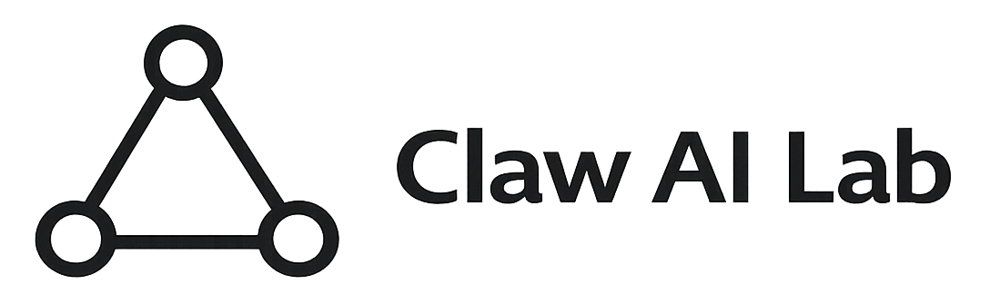
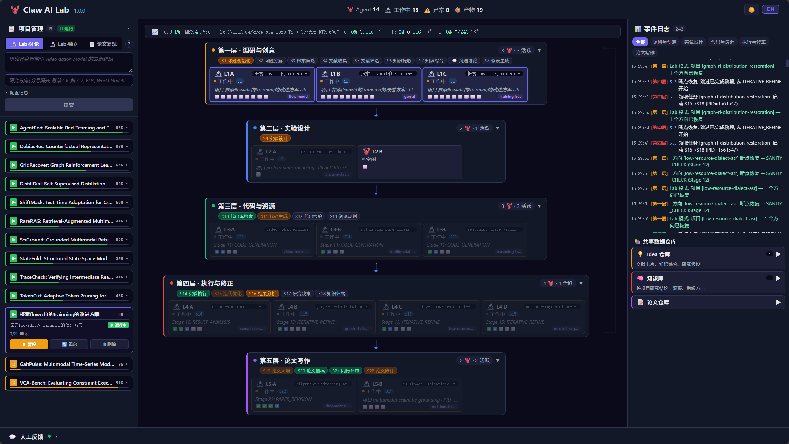
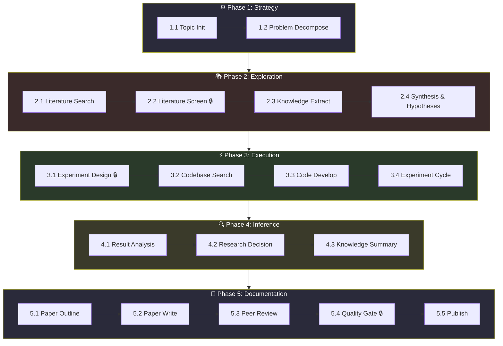
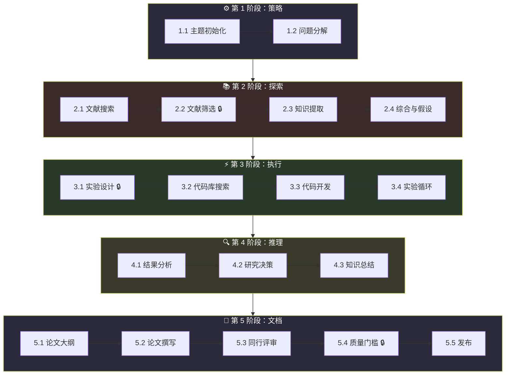
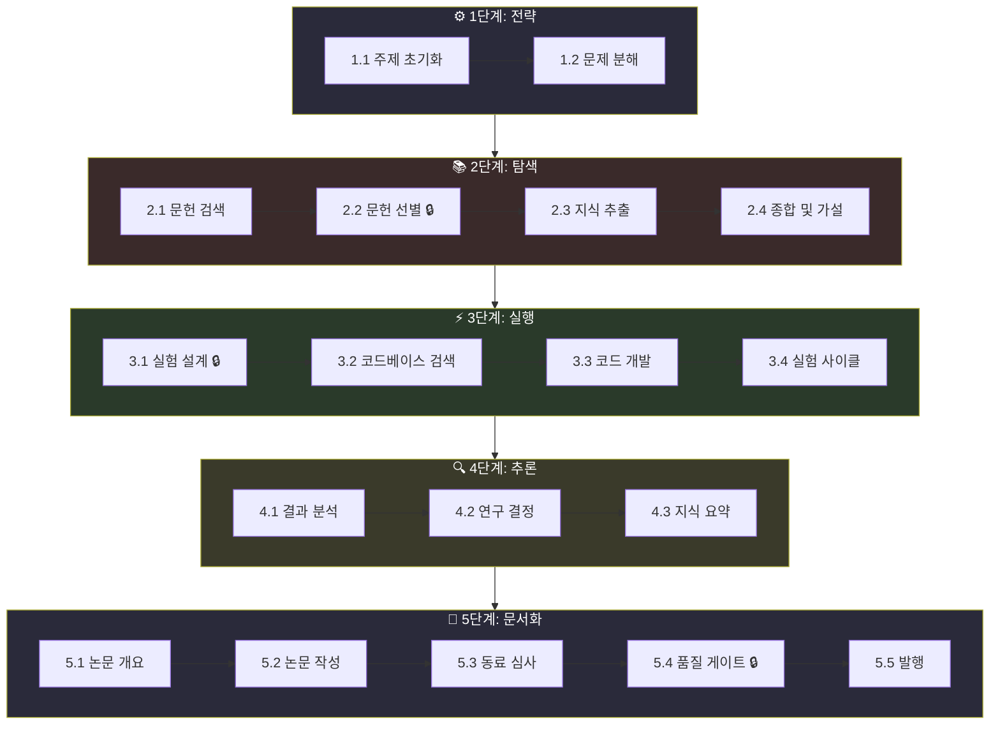

<p align="center"><a href="#english">English</a> · <a href="#中文">中文</a> · <a href="#한국어">한국어</a></p>

<p align="center">
  
</p>

<h1 align="center">Mol-HEP-Lab</h1>

<p align="center">
  Autonomous Multi-Agent Research Platform for High Energy Physics
</p>

<p align="center">
  <a href="https://github.com/ClawHep/Mol-HEP-Lab/blob/main/LICENSE"></a>
  <a href="https://www.rust-lang.org"></a>
  
</p>

---

<a id="english"></a>

## The Problem: What Physicists Actually Face

You know the workflow. You've been there for weeks or months:

- **Copy-pasting code** between analyses, fixing inconsistencies after each copy
- **Repeating literature reviews** for every new search direction, losing what you learned
- **Writing experiment code**, running it manually, rewriting when it fails, running again
- **Waiting for results** while staring at logs, unsure what's actually happening
- **Systematically reviewing** your own work alone, missing blind spots, documenting everything by hand
- **Writing papers manually**, copying results from notebooks, risking transcription errors
- **Tracking systematics** across a spreadsheet that never stays in sync with the code
- **No reproducibility**: six months later, you can't remember which version produced those plots

This is not cutting-edge physics. This is **busywork masquerading as analysis**.

## What If?

What if your analysis ran **end-to-end autonomously**, from research question to publishable paper?

What if **17 specialized agents**—each a domain expert in literature, statistics, detector physics, ML, or peer review—could **collaborate and debate** your physics decisions while you sleep?

What if review gates **kept you in control**, preventing the AI from drifting into hallucination while automating the repetitive parts?

What if **code-driven paper writing** meant your results were always tied to the experiment that produced them, and reviewers could trace every number back to execution logs?

That's Mol-HEP-Lab. A research platform built **for physicists**, not around them.

<p align="center">
  
</p>

## Architecture: The 5-Phase, 18-Stage Pipeline



### Phase Breakdown

**Phase 1: Strategy** (Stages 1-2)
- Clarify your research question, detect domain (HEP-specific), define objectives
- Decompose problem into sub-questions, prioritize experimental directions

**Phase 2: Exploration** (Stages 3-6)
- Search literature (OpenAlex, INSPIRE-HEP), screen by relevance
- Extract structured knowledge from papers, synthesize themes, generate hypotheses
- Human review gate at stage 2.2 (Literature Screen)

**Phase 3: Execution** (Stages 7-10)
- Design experiment with baselines and metrics
- Search for relevant codebases, develop analysis code with AST validation
- Run experiment cycle: execute, analyze results, iterate until convergence
- Human review gate at stage 3.1 (Experiment Design)

**Phase 4: Inference** (Stages 11-13)
- Analyze metrics, generate visualizations, multi-agent review loop
- PROCEED/PIVOT/REFINE decision with decision history tracking
- Consolidate findings across experiments

**Phase 5: Documentation** (Stages 14-18)
- Generate paper structure, draft sections
- Code-aware paper writing with anti-fabrication guards (experiment code + run reports injected as read-only truth)
- Multi-agent peer review (physics, statistics, systematics)
- Human review gate at stage 5.4 (Quality Gate)
- Publish: LaTeX compilation, citation verification, archive

### Review Gates & Human Control

Three critical human review gates ensure you stay in control:

| Gate | Stage | Decision | Purpose |
|:-----|:------|:---------|:--------|
| Literature Screen | 2.2 | Approve/Reject papers | Ensure research direction is sound before investing in implementation |
| Experiment Design | 3.1 | Approve/Refine design | Validate analysis strategy before writing code |
| Quality Gate | 5.4 | Approve/Reject paper | Final physics review, figure validation, typesetting check |

Failed gates trigger **targeted rework**: agents fix specific issues and re-execute only the affected stages, not the entire pipeline.

### Blinding Protocol

For physics searches requiring blinding:

1. **Asimov Data** — Test hypotheses against asymptotic datasets (no signal region data exposed)
2. **10% Partial Unblinding** — Early systematic uncertainty checks with human gate
3. **Full Unblinding** — Explicit approval required before accessing signal region

## Key Features

**Human-in-the-Loop Orchestration**
- 3 review gates strategically placed to prevent AI drift while automating busywork
- Multi-agent discussion mode for consensus building on physics decisions
- Checkpoint/resume: pause any stage and continue later
- Real-time WebSocket dashboard: live progress tracking per stage

**HEP-Native Domain Detection**
- 70+ HEP-specific keywords recognized
- Automatic routing to specialized HEP pipeline
- Convention system: extraction, search (CLs limit-setting), unfolding

**Code-Aware Paper Writing**
- Experiment code and run reports injected as read-only context
- Anti-fabrication rules: LLM cannot hallucinate numerical results
- Reviewers verify claims against ground truth artifacts
- Prevents the "paper says X but code does Y" disaster

**17 Specialized Agents**
- Lead Analyst, Investigator, Theory Scout, Data Explorer
- Detector Specialist, Signal Lead, Background Estimator
- Systematic Source Evaluator, Systematics Fitter, ML Specialist
- Cross Checker, Critical Reviewer, Constructive Reviewer
- Physics Reviewer, Arbiter, Plot Validator, Note Writer
- Each brings domain expertise; decisions emerge from multi-agent debate

**Integrated HEP Toolchain**
- Data I/O: `uproot`, `awkward-array`
- Histogramming: `hist`
- Statistical inference: `pyhf`
- Jet clustering: `fastjet`
- Plotting: `mplhep` for publication-quality figures
- ML: `xgboost`, `scikit-learn`, PyTorch

**Built on Solid Engineering**
- Pure Rust backend: 17 crates, 590+ passing tests
- React 19 + TypeScript frontend with WebSocket live updates
- Automatic HEP code validation, smoke testing, LLM-driven error fixing
- Sandboxed experiment execution with configurable Python environment

## Quick Start: Choose Your Path

### Option 1: Manual Setup (Full Control)

For developers who want to understand every step.

**Prerequisites:**
- Rust 1.80+ ([install](https://rustup.rs/))
- Node.js 18+ ([install](https://nodejs.org/))
- Python 3.11+ with pip

**Steps:**

```bash
git clone https://github.com/ClawHep/Mol-HEP-Lab.git
cd Mol-HEP-Lab

# Build Rust backend
cargo build --release

# Build React frontend
cd frontend && npm install && npm run build && cd ..

# Install HEP Python dependencies
pip install uproot awkward hist pyhf fastjet mplhep xgboost scikit-learn torch
```

**Initialize and run:**

```bash
# Interactive setup wizard
./target/release/mol init

# Verify dependencies
./target/release/mol doctor

# Start web interface (runs at http://localhost:5903/)
./target/release/mol serve
```

**Run a headless analysis:**

```bash
./target/release/mol run --topic "Search for Z' resonances in dilepton channel"
./target/release/mol report
```

### Option 2: One-Shot with Claude Code

For physicists who want everything automated.

You have this repo cloned and you have [Claude Code](https://claude.com/claude-code) installed locally. Just ask:

```
"Set up Mol-HEP-Lab and run an analysis on [your research question]"
```

Claude Code will:
- Detect your environment (macOS/Linux/Windows)
- Build Rust backend and frontend
- Install HEP Python dependencies
- Initialize config.mol.yaml with your research topic
- Start the analysis pipeline
- Show you live progress in the dashboard

### Option 3: Autonomous Agent Setup (CLAUDE.md)

For those deploying Mol-HEP-Lab with autonomous Claude agents.

The repo includes `/hep/CLAUDE.md`: a system prompt that teaches autonomous agents the HEP analysis methodology, blinding protocol, review gates, and 17-agent coordination rules.

When you invoke a Claude agent with Mol-HEP-Lab's context:

```
Agent automatically knows:
- The 5-phase, 18-stage pipeline structure
- Where to checkpoint (the 3 human review gates)
- How to run stages in isolation
- HEP-specific conventions (extraction, search, unfolding)
- How to manage experiment isolation
- Blinding protocol for physics searches
```

Agents can autonomously:
- Propose research questions and decompose problems
- Search and screen literature with decision history
- Design and refine experiments
- Run analysis code and iterate
- Generate peer-reviewed papers
- **Pause at human gates** and request approval

See [hep/CLAUDE.md](hep/CLAUDE.md) for the full agent instructions.

## Configuration

Generate config interactively:

```bash
mol init              # Interactive setup wizard
mol doctor            # Verify all dependencies
```

Or manually edit `config.mol.yaml`:

```yaml
project:
  name: "my-hep-analysis"

research:
  topic: "Search for rare Z boson decays in four-lepton final state"
  domains: ["high-energy-physics"]

experiment:
  mode: "sandbox"
  sandbox:
    python_path: "/usr/bin/python3"

llm:
  provider: "openai-compatible"
  primary_model: "claude-opus-4-1-20250805"
  coding_model: "claude-opus-4-1-20250805"

security:
  hitl_required_phases: ["exploration", "execution", "documentation"]
```

## Agent Roster

| Agent | Primary Roles | Expertise |
|:------|:--------------|:----------|
| Lead Analyst | Strategy, Design, Analysis | Orchestrates research direction and high-level decisions |
| Investigator | Literature search, screening, extraction | Retrieves papers, filters by relevance, builds knowledge base |
| Theory Scout | Synthesis | Connects results to theoretical predictions, generates hypotheses |
| Data Explorer | Advisor: dataset examination | Identifies distributions, correlations, data quality issues |
| Detector Specialist | Advisor: detector response | Handles efficiency, resolution, acceptance corrections |
| Signal Lead | Code development | Designs signal region, optimizes selection cuts |
| Background Estimator | Advisor: background modeling | Builds background models from data or simulation |
| Systematic Source Evaluator | Advisor: systematics | Catalogs systematic uncertainties, impact assessment |
| Systematics Fitter | Experiment cycle | Implements systematic variation infrastructure, fits |
| ML Specialist | Advisor: machine learning | Designs/validates classifiers and neural networks |
| Cross Checker | Advisor: physics validation | Validates steps against physics principles |
| Critical Reviewer | Advisor: gap identification | Identifies logical gaps, methodological risks |
| Constructive Reviewer | Advisor: improvements | Suggests improvements, alternative approaches |
| Physics Reviewer | Peer review | Assesses physics validity, publication readiness |
| Arbiter | Decision & quality gate | Resolves disagreements, final approval authority |
| Plot Validator | Advisor: figure quality | Verifies figure specs, publication compliance |
| Note Writer | Outline, write, publish | Assembles documentation into publication format |

## Testing

```bash
cargo test
```

The platform includes **590 passing tests** covering:
- Agent behavior and coordination
- Pipeline state transitions
- HEP convention enforcement
- Literature retrieval and screening
- Code validation and execution
- Paper generation and review

## Citation

If Mol-HEP-Lab contributes to your particle physics research, please cite:

```bibtex
@misc{wang2026molheplab,
  author       = {Wang, Chin-Zhu},
  title        = {Mol-HEP-Lab: Autonomous Multi-Agent Research Platform for High-Energy Physics},
  year         = {2026},
  url          = {https://github.com/ClawHep/Mol-HEP-Lab},
  note         = {GitHub repository}
}
```

## License

MIT License — see [LICENSE](LICENSE) for details.

## Contributing

Contributions are welcome. The platform is designed to be extended with new agents, analysis types, and review workflows.

Start with the architecture documentation in [docs/architecture-deep-dive.md](docs/architecture-deep-dive.md) for system design details. See [hep/CLAUDE.md](hep/CLAUDE.md) for HEP methodology and agent rules.

---

<a id="中文"></a>

## 物理学家的真实困境

你很清楚这个流程。你已经经历过数周甚至数月：

- **复制粘贴代码**：在多个分析中重复使用，每次都要修复不一致性
- **重复进行文献综述**：每个新方向都要重新审视，之前的学习丢失殆尽
- **手写实验代码**：运行、失败、重写、再运行，周而复始
- **等待结果**：盯着日志，不知道实际发生了什么
- **系统地审查自己的工作**：一个人孤独地工作，容易遗漏盲点，所有文档都要手工记录
- **手动编写论文**：从笔记本复制结果，冒着转录错误的风险
- **跟踪系统不确定性**：用永远无法与代码同步的电子表格管理
- **无法重复**：六个月后，你根本不记得哪个版本生成了这些图表

这不是尖端物理学。这是**被伪装成分析的繁琐工作**。

## 如果呢？

如果你的分析能**从头到尾自主运行**，从研究问题到可发表的论文，会怎样？

如果**17 个专业代理**——每个都是文献、统计、探测器物理、机器学习或同行评审方面的专家——能够**协作和辩论**你的物理决策，而你在睡觉，会怎样？

如果评审门槛能**让你保持控制**，防止人工智能陷入幻想，同时自动化重复部分，会怎样？

如果**代码驱动的论文编写**意味着你的结果总是与生成它们的实验相关联，评审者可以将每个数字追溯到执行日志，会怎样？

这就是 Mol-HEP-Lab。一个为物理学家构建的研究平台，而不是围绕物理学家构建的。

<p align="center">
  
</p>

## 架构：5 阶段、18 步骤的管道



### 阶段细分

**第 1 阶段：策略**（步骤 1-2）
- 澄清研究问题，检测领域（高能物理特定），定义目标
- 将问题分解为子问题，优先化实验方向

**第 2 阶段：探索**（步骤 3-6）
- 搜索文献（OpenAlex、INSPIRE-HEP），按相关性筛选
- 从论文中提取结构化知识，综合主题，生成假设
- 第 2.2 步的人工评审门槛（文献筛选）

**第 3 阶段：执行**（步骤 7-10）
- 设计实验、基准和指标
- 搜索相关代码库，使用 AST 验证开发分析代码
- 运行实验循环：执行、分析结果、迭代直到收敛
- 第 3.1 步的人工评审门槛（实验设计）

**第 4 阶段：推理**（步骤 11-13）
- 分析指标，生成可视化，多代理评审循环
- 继续/改进/重新定义决策及决策历史跟踪
- 整合多个实验的发现

**第 5 阶段：文档**（步骤 14-18）
- 生成论文结构，起草章节
- 代码感知的论文编写，包含反伪造守卫（实验代码和运行报告作为只读真理被注入）
- 多代理同行评审（物理、统计、系统不确定性）
- 第 5.4 步的人工评审门槛（质量门槛）
- 发布：LaTeX 编译、引用验证、存档

### 评审门槛与人工控制

三个关键的人工评审门槛确保你保持控制：

| 门槛 | 步骤 | 决策 | 目的 |
|:-----|:------|:---------|:--------|
| 文献筛选 | 2.2 | 批准/拒绝论文 | 在投入实现前确保研究方向合理 |
| 实验设计 | 3.1 | 批准/改进设计 | 在编写代码前验证分析策略 |
| 质量门槛 | 5.4 | 批准/拒绝论文 | 最终物理评审、图表验证、排版检查 |

失败的门槛触发**有针对性的返工**：代理修复特定问题并仅重新执行受影响的步骤，而不是整个管道。

### 盲法协议

对于需要盲法的物理搜索：

1. **Asimov 数据**——针对渐近数据集测试假设（不暴露信号区域数据）
2. **10% 部分解盲**——早期系统不确定性检查，人工门槛
3. **完全解盲**——需要明确批准才能访问信号区域

## 关键特性

**人机协作编排**
- 3 个战略位置的评审门槛，防止人工智能偏离同时自动化繁琐工作
- 多代理讨论模式，用于物理决策共识构建
- 检查点/恢复：暂停任何步骤并稍后继续
- 实时 WebSocket 仪表板：每步进度实时跟踪

**高能物理本地领域检测**
- 识别 70+ 高能物理特定关键字
- 自动路由到专业高能物理管道
- 约定系统：提取、搜索（CLs 限制设置）、展开

**代码感知的论文编写**
- 实验代码和运行报告作为只读上下文注入
- 反伪造规则：大语言模型无法编造数值结果
- 评审者根据基本事实文物验证声明
- 防止"论文说 X 但代码做 Y"的灾难

**17 个专业代理**
- 首席分析师、调查员、理论侦察兵、数据探索者
- 探测器专家、信号领导、背景估计员
- 系统源评估员、系统拟合员、机器学习专家
- 交叉检查员、关键评审员、建设性评审员
- 物理评审员、仲裁者、图表验证员、笔记撰写员
- 每个都带来领域专长；决策源于多代理辩论

**集成高能物理工具链**
- 数据 I/O：`uproot`、`awkward-array`
- 直方图：`hist`
- 统计推断：`pyhf`
- 喷气簇：`fastjet`
- 绘图：`mplhep` 用于出版质量图表
- 机器学习：`xgboost`、`scikit-learn`、PyTorch

**建立在坚实工程基础上**
- 纯 Rust 后端：17 个 crate，590+ 通过的测试
- React 19 + TypeScript 前端，WebSocket 实时更新
- 自动高能物理代码验证、冒烟测试、大语言模型驱动的错误修复
- 沙箱实验执行，可配置 Python 环境

## 快速开始：选择你的路径

### 选项 1：手动设置（完全控制）

适合想要理解每一步的开发者。

**先决条件：**
- Rust 1.80+ ([安装](https://rustup.rs/))
- Node.js 18+ ([安装](https://nodejs.org/))
- Python 3.11+ 和 pip

**步骤：**

```bash
git clone https://github.com/ClawHep/Mol-HEP-Lab.git
cd Mol-HEP-Lab

# 构建 Rust 后端
cargo build --release

# 构建 React 前端
cd frontend && npm install && npm run build && cd ..

# 安装高能物理 Python 依赖
pip install uproot awkward hist pyhf fastjet mplhep xgboost scikit-learn torch
```

**初始化并运行：**

```bash
# 交互式设置向导
./target/release/mol init

# 验证依赖
./target/release/mol doctor

# 启动网页界面（运行在 http://localhost:5903/）
./target/release/mol serve
```

**运行无头分析：**

```bash
./target/release/mol run --topic "在双轻子通道中搜索 Z' 共振"
./target/release/mol report
```

### 选项 2：使用 Claude Code 一键启动

适合想要一切自动化的物理学家。

你已经克隆了这个仓库，并且安装了 [Claude Code](https://claude.com/claude-code)。只需问：

```
"设置 Mol-HEP-Lab 并对[你的研究问题]运行分析"
```

Claude Code 将会：
- 检测你的环境（macOS/Linux/Windows）
- 构建 Rust 后端和前端
- 安装高能物理 Python 依赖
- 用你的研究主题初始化 config.mol.yaml
- 启动分析管道
- 在仪表板中显示实时进度

### 选项 3：自主代理设置（CLAUDE.md）

适合用自主 Claude 代理部署 Mol-HEP-Lab。

仓库包括 `/hep/CLAUDE.md`：一个系统提示，教导自主代理高能物理分析方法、盲法协议、评审门槛和 17 代理协调规则。

当你用 Mol-HEP-Lab 的上下文调用 Claude 代理时：

```
代理自动知道：
- 5 阶段、18 步骤的管道结构
- 检查点位置（3 个人工评审门槛）
- 如何隔离运行步骤
- 高能物理特定约定（提取、搜索、展开）
- 如何管理实验隔离
- 盲法协议用于物理搜索
```

代理可以自主：
- 提出研究问题并分解问题
- 搜索和筛选文献并记录决策历史
- 设计和改进实验
- 运行分析代码和迭代
- 生成同行评审的论文
- **在人工门槛处暂停**并请求批准

有关完整的代理说明，请参阅 [hep/CLAUDE.md](hep/CLAUDE.md)。

## 配置

交互式生成配置：

```bash
mol init              # 交互式设置向导
mol doctor            # 验证所有依赖
```

或手动编辑 `config.mol.yaml`：

```yaml
project:
  name: "my-hep-analysis"

research:
  topic: "在四轻子末态中搜索稀见 Z 玻色子衰变"
  domains: ["high-energy-physics"]

experiment:
  mode: "sandbox"
  sandbox:
    python_path: "/usr/bin/python3"

llm:
  provider: "openai-compatible"
  primary_model: "claude-opus-4-1-20250805"
  coding_model: "claude-opus-4-1-20250805"

security:
  hitl_required_phases: ["exploration", "execution", "documentation"]
```

## 代理名册

| 代理 | 主要角色 | 专业领域 |
|:------|:--------------|:----------|
| 首席分析师 | 策略、设计、分析 | 编排研究方向和高级决策 |
| 调查员 | 文献搜索、筛选、提取 | 检索论文、按相关性过滤、建立知识库 |
| 理论侦察兵 | 综合 | 将结果与理论预测联系起来，生成假设 |
| 数据探索者 | 顾问：数据集检查 | 识别分布、相关性、数据质量问题 |
| 探测器专家 | 顾问：探测器响应 | 处理效率、分辨率、接受度校正 |
| 信号领导 | 代码开发 | 设计信号区域，优化选择切割 |
| 背景估计员 | 顾问：背景建模 | 从数据或模拟构建背景模型 |
| 系统源评估员 | 顾问：系统不确定性 | 编目系统不确定性，影响评估 |
| 系统拟合员 | 实验循环 | 实现系统变化基础设施、拟合 |
| 机器学习专家 | 顾问：机器学习 | 设计/验证分类器和神经网络 |
| 交叉检查员 | 顾问：物理验证 | 根据物理原则验证步骤 |
| 关键评审员 | 顾问：差距识别 | 识别逻辑差距、方法风险 |
| 建设性评审员 | 顾问：改进建议 | 建议改进、替代方法 |
| 物理评审员 | 同行评审 | 评估物理有效性、出版准备度 |
| 仲裁者 | 决策与质量门槛 | 解决分歧、最终批准权 |
| 图表验证员 | 顾问：图表质量 | 验证图表规范、出版符合性 |
| 笔记撰写员 | 大纲、撰写、发布 | 将文档组装成出版物 |

## 测试

```bash
cargo test
```

该平台包括 **590 个通过的测试**，涵盖：
- 代理行为和协调
- 管道状态转换
- 高能物理约定执行
- 文献检索和筛选
- 代码验证和执行
- 论文生成和评审

## 引用

如果 Mol-HEP-Lab 对你的粒子物理研究有帮助，请引用：

```bibtex
@misc{wang2026molheplab,
  author       = {Wang, Chin-Zhu},
  title        = {Mol-HEP-Lab: Autonomous Multi-Agent Research Platform for High-Energy Physics},
  year         = {2026},
  url          = {https://github.com/ClawHep/Mol-HEP-Lab},
  note         = {GitHub repository}
}
```

## 许可证

MIT 许可证 — 详见 [LICENSE](LICENSE)。

## 贡献

欢迎贡献。该平台设计为可扩展，支持新代理、分析类型和评审工作流。

从 [docs/architecture-deep-dive.md](docs/architecture-deep-dive.md) 中的架构文档开始了解系统设计细节。有关高能物理方法和代理规则，请参阅 [hep/CLAUDE.md](hep/CLAUDE.md)。

---

<a id="한국어"></a>

## 물리학자들의 실제 고통

당신은 이 과정을 잘 알고 있습니다. 몇 주 또는 몇 달간 경험했습니다:

- **코드 복사 붙여넣기**: 여러 분석에서 재사용하며 매번 불일치 수정
- **문헌 검토 반복**: 각 새로운 방향마다 재검토하며 이전 학습 손실
- **실험 코드 수작업**: 실행, 실패, 재작성, 다시 실행의 반복
- **결과 대기**: 로그를 지켜보며 실제 무엇이 일어나는지 불명확
- **자신의 작업 시스템적 검토**: 혼자서 작업하며 맹점 놓치기 쉽고 모든 문서 수동 기록
- **논문 수동 작성**: 노트북에서 결과 복사하며 전사 오류 위험
- **시스템 불확실성 추적**: 항상 코드와 동기화되지 않는 스프레드시트 사용
- **재현 불가능**: 6개월 후 어떤 버전이 이 도표를 생성했는지 기억 불가

이것은 최첨단 물리학이 아닙니다. 이것은 **분석으로 위장한 반복 작업**입니다.

## 만약...?

당신의 분석이 **연구 질문에서 출판 가능한 논문까지 자동으로 실행**된다면 어떻게 될까요?

**17개의 전문 에이전트**—각각 문헌, 통계, 검출기 물리학, 기계학습 또는 동료 심사의 전문가—가 당신이 자는 동안 **협력하고 토론**할 수 있다면 어떻게 될까요?

검토 게이트가 **당신을 통제 상태로 유지**하면서 반복적인 부분을 자동화하여 AI가 환각에 빠지는 것을 방지한다면 어떻게 될까요?

**코드 기반 논문 작성**이 당신의 결과가 항상 그것을 생성한 실험과 연결되고 검토자가 모든 숫자를 실행 로그로 추적할 수 있다는 의미라면 어떻게 될까요?

이것이 Mol-HEP-Lab입니다. 물리학자를 위해 구축된 연구 플랫폼입니다.

<p align="center">
  
</p>

## 아키텍처: 5단계, 18단계 파이프라인



### 단계별 세부 사항

**1단계: 전략**(단계 1-2)
- 연구 질문을 명확히 하고, 영역을 검출하고(고에너지 물리학 특정), 목표를 정의합니다
- 문제를 부분 질문으로 분해하고, 실험 방향을 우선순위 지정합니다

**2단계: 탐색**(단계 3-6)
- 문헌 검색(OpenAlex, INSPIRE-HEP), 관련성으로 선별
- 논문에서 구조화된 지식 추출, 테마 종합, 가설 생성
- 단계 2.2에서 인간 검토 게이트(문헌 선별)

**3단계: 실행**(단계 7-10)
- 기준선 및 메트릭으로 실험 설계
- 관련 코드베이스 검색, AST 검증으로 분석 코드 개발
- 실험 사이클 실행: 수행, 결과 분석, 수렴까지 반복
- 단계 3.1에서 인간 검토 게이트(실험 설계)

**4단계: 추론**(단계 11-13)
- 메트릭 분석, 시각화 생성, 다중 에이전트 검토 루프
- 계속/수정/정의 결정 및 결정 이력 추적
- 여러 실험의 발견 통합

**5단계: 문서화**(단계 14-18)
- 논문 구조 생성, 섹션 초안
- 코드 인식 논문 작성, 위조 방지 가드 포함(실험 코드 및 실행 보고서를 읽기 전용 진실로 주입)
- 다중 에이전트 동료 심사(물리학, 통계, 시스템 불확실성)
- 단계 5.4에서 인간 검토 게이트(품질 게이트)
- 발행: LaTeX 컴파일, 인용 검증, 아카이브

### 검토 게이트 및 인간 통제

세 가지 핵심 인간 검토 게이트는 당신이 통제 상태를 유지하도록 보장합니다:

| 게이트 | 단계 | 결정 | 목적 |
|:-----|:------|:---------|:--------|
| 문헌 선별 | 2.2 | 논문 승인/거부 | 구현에 투자하기 전에 연구 방향이 건전한지 확인 |
| 실험 설계 | 3.1 | 설계 승인/수정 | 코드 작성 전에 분석 전략 검증 |
| 품질 게이트 | 5.4 | 논문 승인/거부 | 최종 물리학 검토, 도표 검증, 타이포그래피 확인 |

실패한 게이트는 **대상별 재작업**을 유발합니다: 에이전트는 특정 문제를 수정하고 전체 파이프라인이 아닌 영향을 받은 단계만 재실행합니다.

### 블라인드 프로토콜

블라인딩이 필요한 물리학 검색의 경우:

1. **Asimov 데이터** — 점근 데이터셋에 대한 가설 테스트(신호 영역 데이터 노출 안 함)
2. **10% 부분 언블라인딩** — 초기 시스템 불확실성 검사, 인간 게이트
3. **완전 언블라인딩** — 신호 영역 접근 전에 명시적 승인 필요

## 주요 기능

**인간-기계 협력 오케스트레이션**
- 3개의 전략적 배치 검토 게이트로 AI 편차 방지 및 반복 작업 자동화
- 물리학 결정을 위한 다중 에이전트 토론 모드
- 검사점/재개: 모든 단계 일시 중지 및 나중에 계속
- 실시간 WebSocket 대시보드: 단계별 실시간 진행률 추적

**고에너지 물리학 네이티브 영역 감지**
- 70개 이상의 고에너지 물리학 특정 키워드 인식
- 전문 고에너지 물리학 파이프라인으로의 자동 라우팅
- 협약 시스템: 추출, 검색(CL 제한 설정), 전개

**코드 인식 논문 작성**
- 실험 코드 및 실행 보고서를 읽기 전용 컨텍스트로 주입
- 반위조 규칙: LLM이 수치 결과를 환각할 수 없음
- 검토자는 기본 사실 아티팩트에 대해 주장 검증
- "논문은 X라고 말하지만 코드는 Y를 함" 재앙 방지

**17개의 전문 에이전트**
- 수석 분석가, 조사관, 이론 정찰, 데이터 탐색
- 검출기 전문가, 신호 리드, 배경 추정자
- 시스템 소스 평가자, 시스템 피터, ML 전문가
- 교차 검사관, 비판적 검토자, 건설적 검토자
- 물리 검토자, 중재자, 도표 검증자, 노트 작성자
- 각각은 영역 전문성을 가져오며; 결정은 다중 에이전트 토론에서 나옵니다

**통합 고에너지 물리학 도구 체인**
- 데이터 I/O: `uproot`, `awkward-array`
- 히스토그래밍: `hist`
- 통계 추론: `pyhf`
- 제트 클러스터링: `fastjet`
- 도표 작성: `mplhep` 출판 품질 도표용
- 머신러닝: `xgboost`, `scikit-learn`, PyTorch

**견고한 엔지니어링 기반**
- 순수 Rust 백엔드: 17개의 크레이트, 590+ 통과 테스트
- React 19 + TypeScript 프론트엔드, WebSocket 실시간 업데이트
- 자동 고에너지 물리학 코드 검증, 스모크 테스트, LLM 기반 오류 수정
- 샌드박스 실험 실행, 구성 가능한 Python 환경

## 빠른 시작: 경로 선택

### 옵션 1: 수동 설정(완전 통제)

모든 단계를 이해하려는 개발자를 위한 것입니다.

**사전 요구사항:**
- Rust 1.80+ ([설치](https://rustup.rs/))
- Node.js 18+ ([설치](https://nodejs.org/))
- Python 3.11+ 및 pip

**단계:**

```bash
git clone https://github.com/ClawHep/Mol-HEP-Lab.git
cd Mol-HEP-Lab

# Rust 백엔드 구축
cargo build --release

# React 프론트엔드 구축
cd frontend && npm install && npm run build && cd ..

# 고에너지 물리학 Python 의존성 설치
pip install uproot awkward hist pyhf fastjet mplhep xgboost scikit-learn torch
```

**초기화 및 실행:**

```bash
# 대화형 설정 마법사
./target/release/mol init

# 의존성 확인
./target/release/mol doctor

# 웹 인터페이스 시작(http://localhost:5903/에서 실행)
./target/release/mol serve
```

**헤드리스 분석 실행:**

```bash
./target/release/mol run --topic "쌍 경양자 채널에서 Z' 공명 검색"
./target/release/mol report
```

### 옵션 2: Claude Code를 통한 원샷 실행

자동화를 원하는 물리학자를 위한 것입니다.

이 저장소를 복제했고 [Claude Code](https://claude.com/claude-code)를 설치했습니다. 그냥 물어보세요:

```
"Mol-HEP-Lab을 설정하고 [당신의 연구 질문]에 대한 분석을 실행하세요"
```

Claude Code가 다음을 수행합니다:
- 환경 감지(macOS/Linux/Windows)
- Rust 백엔드 및 프론트엔드 구축
- 고에너지 물리학 Python 의존성 설치
- 연구 주제로 config.mol.yaml 초기화
- 분석 파이프라인 시작
- 대시보드에 실시간 진행률 표시

### 옵션 3: 자율 에이전트 설정(CLAUDE.md)

자율 Claude 에이전트로 Mol-HEP-Lab을 배포하는 경우를 위한 것입니다.

저장소에 `/hep/CLAUDE.md`가 포함되어 있습니다: 자율 에이전트에게 고에너지 물리학 분석 방법론, 블라인드 프로토콜, 검토 게이트 및 17 에이전트 조정 규칙을 가르치는 시스템 프롬프트입니다.

Mol-HEP-Lab 컨텍스트를 사용하여 Claude 에이전트를 호출하면:

```
에이전트는 자동으로 알고 있습니다:
- 5단계, 18단계 파이프라인 구조
- 검사점 위치(3개 인간 검토 게이트)
- 단계를 격리하여 실행하는 방법
- 고에너지 물리학 특정 협약(추출, 검색, 전개)
- 실험 격리 관리 방법
- 물리 검색을 위한 블라인드 프로토콜
```

에이전트는 자율적으로 수행할 수 있습니다:
- 연구 질문 제안 및 문제 분해
- 결정 이력이 있는 문헌 검색 및 선별
- 실험 설계 및 개선
- 분석 코드 실행 및 반복
- 동료 검토 논문 생성
- **인간 게이트에서 일시 중지**및 승인 요청

전체 에이전트 지침은 [hep/CLAUDE.md](hep/CLAUDE.md)를 참조하세요.

## 설정

대화형으로 구성을 생성합니다:

```bash
mol init              # 대화형 설정 마법사
mol doctor            # 모든 의존성 확인
```

또는 `config.mol.yaml`을 수동으로 편집합니다:

```yaml
project:
  name: "my-hep-analysis"

research:
  topic: "4개 경양자 최종 상태에서 드물게 나타나는 Z 보손 붕괴 검색"
  domains: ["high-energy-physics"]

experiment:
  mode: "sandbox"
  sandbox:
    python_path: "/usr/bin/python3"

llm:
  provider: "openai-compatible"
  primary_model: "claude-opus-4-1-20250805"
  coding_model: "claude-opus-4-1-20250805"

security:
  hitl_required_phases: ["exploration", "execution", "documentation"]
```

## 에이전트 명단

| 에이전트 | 주요 역할 | 전문성 |
|:------|:--------------|:----------|
| 수석 분석가 | 전략, 설계, 분석 | 연구 방향 및 고급 결정 오케스트레이션 |
| 조사관 | 문헌 검색, 선별, 추출 | 논문 검색, 관련성 필터링, 지식 기반 구축 |
| 이론 정찰 | 종합 | 결과를 이론 예측과 연결, 가설 생성 |
| 데이터 탐색 | 고문: 데이터셋 검사 | 분포, 상관관계, 데이터 품질 문제 식별 |
| 검출기 전문가 | 고문: 검출기 반응 | 효율, 분해능, 허용 보정 처리 |
| 신호 리드 | 코드 개발 | 신호 영역 설계, 선택 컷 최적화 |
| 배경 추정자 | 고문: 배경 모델링 | 데이터 또는 시뮬레이션에서 배경 모델 구축 |
| 시스템 소스 평가자 | 고문: 시스템 불확실성 | 시스템 불확실성 편목, 영향 평가 |
| 시스템 피터 | 실험 사이클 | 시스템 변화 인프라 구현, 피팅 |
| ML 전문가 | 고문: 머신러닝 | 분류기 및 신경망 설계/검증 |
| 교차 검사관 | 고문: 물리 검증 | 물리 원리에 대한 단계 검증 |
| 비판적 검토자 | 고문: 간격 식별 | 논리적 간격, 방법론 위험 식별 |
| 건설적 검토자 | 고문: 개선 제안 | 개선, 대체 방법 제안 |
| 물리 검토자 | 동료 심사 | 물리학 유효성, 출판 준비 평가 |
| 중재자 | 결정 및 품질 게이트 | 의견 불일치 해결, 최종 승인 권한 |
| 도표 검증자 | 고문: 도표 품질 | 도표 사양, 출판 준수 확인 |
| 노트 작성자 | 개요, 작성, 발행 | 문서를 출판 형식으로 조립 |

## 테스트

```bash
cargo test
```

플랫폼에 포함된 **590개의 통과 테스트**가 다음을 포함합니다:
- 에이전트 행동 및 조율
- 파이프라인 상태 전환
- 고에너지 물리학 협약 집행
- 문헌 검색 및 선별
- 코드 검증 및 실행
- 논문 생성 및 검토

## 인용

Mol-HEP-Lab이 입자 물리학 연구에 기여했다면 다음을 인용하세요:

```bibtex
@misc{wang2026molheplab,
  author       = {Wang, Chin-Zhu},
  title        = {Mol-HEP-Lab: Autonomous Multi-Agent Research Platform for High-Energy Physics},
  year         = {2026},
  url          = {https://github.com/ClawHep/Mol-HEP-Lab},
  note         = {GitHub repository}
}
```

## 라이선스

MIT 라이선스 — 자세한 내용은 [LICENSE](LICENSE)를 참조하세요.

## 기여

기여를 환영합니다. 플랫폼은 새로운 에이전트, 분석 유형 및 검토 워크플로우를 추가하도록 설계되었습니다.

시스템 설계 세부 사항을 위해 [docs/architecture-deep-dive.md](docs/architecture-deep-dive.md)의 아키텍처 문서부터 시작합니다. 고에너지 물리학 방법론 및 에이전트 규칙은 [hep/CLAUDE.md](hep/CLAUDE.md)를 참조하세요.
